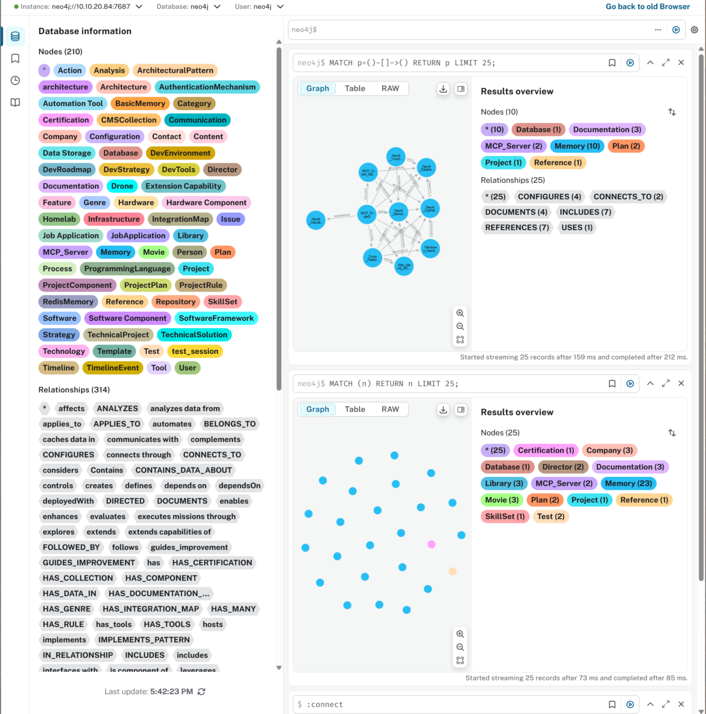

# 🎯 Unified Memory Server

A unified AI memory server integrating Neo4j, Basic Memory, and Redis Memory Server for multi-agent access. This project provides graph-based relationships, structured knowledge persistence, and conversational context with semantic search capabilities.

## 🎯 Overview

## 📊 Visual Overview

The Unified Memory Server combines three complementary memory systems to provide a complete memory solution for AI agents:

1. **Neo4j Memory System** - Graph-based relationship modeling and natural language querying
2. **Basic Memory (Obsidian)** - Structured knowledge with markdown persistence  
3. **Redis Memory Server** - Redis-powered memory system providing both short-term conversational context and long-term memory with semantic search capabilities

## 👥 Authors

- **Eddy Kawira** ([@eddygk](https://github.com/eddygk))
- **Claude AI** (Anthropic) - Architecture design and implementation guidance

## 🚀 Key Features

### Based on Redis Agent Memory Server

This project extends the [Redis Agent Memory Server](https://github.com/redis-developer/agent-memory-server) with:

- **Working Memory**: Session-scoped storage with automatic summarization
- **Long-Term Memory**: Persistent storage with semantic search capabilities
- **Graph Relationships**: Entity and relationship modeling with Neo4j
- **Structured Notes**: Markdown-based knowledge persistence with Basic Memory
- **Multi-Agent Support**: Namespace isolation for multiple AI agents
- **Authentication**: OAuth2/JWT support for secure multi-client access

### Additional Integrations

- **Neo4j Knowledge Graph**: Natural language queries and relationship traversal
- **Basic Memory (Obsidian)**: Persistent markdown notes and canvases
- **Cross-System Synchronization**: Unified access across all memory systems

## 📋 Prerequisites

- Docker Engine 24.0+
- Docker Compose 2.20+
- Git
- Python 3.12+ (for development)
- OpenSSL (for certificate generation)

## 🏃‍♂️ Quick Start

1. Clone the repository:
```bash
git clone https://github.com/eddygk/unified-memory-server.git
cd unified-memory-server
```

2. Copy environment template:
```bash
cp .env.example .env.production
```

3. Configure your environment variables (see Configuration section)

4. Start the services:
```bash
docker-compose -f docker-compose.prod.yml up -d
```

5. Verify deployment:
```bash
curl http://localhost:8000/health
```

## 📚 Documentation

- [Deployment Guide](docs/deployment.md) - Complete deployment instructions for your subnet
- [Client Configuration](docs/client-config.md) - Setting up Claude and other AI agents
- [API Reference](docs/api.md) - REST API and MCP endpoints
- [Memory Selection Guide](docs/memory-selection.md) - When to use each memory system
- [Security Guide](docs/security.md) - Authentication and security best practices
- [MCP Proxy Client](docs/mcp-proxy.md) - OAuth2 proxy for Claude Desktop

## 🔧 Configuration

Key environment variables:

```bash
# Network Configuration
REDIS_URL=redis://redis:6379
PORT=8000
MCP_PORT=9000
HOST=0.0.0.0

# Authentication (Required for production)
DISABLE_AUTH=false
OAUTH2_ISSUER_URL=https://your-domain.auth0.com/
OAUTH2_AUDIENCE=https://memory.your-domain.local
OAUTH2_ALGORITHMS=["RS256"]

# AI Service Keys
OPENAI_API_KEY=your-openai-key
ANTHROPIC_API_KEY=your-anthropic-key

# Memory Configuration
LONG_TERM_MEMORY=true
WINDOW_SIZE=20
ENABLE_TOPIC_EXTRACTION=true
ENABLE_NER=true

# Neo4j Configuration (optional)
NEO4J_URL=bolt://neo4j:7687
NEO4J_USERNAME=neo4j
NEO4J_PASSWORD=your-password

# Basic Memory Configuration (optional)
BASIC_MEMORY_PATH=/path/to/obsidian/vault
```

## 🏗️ Architecture

```
┌─────────────────────────────────────────────────────────────────────────────┐
│                          🤖 AI Agents (Clients)                            │
│  ┌─────────────┐    ┌─────────────┐    ┌─────────────┐                     │
│  │   Claude    │    │   GPT-4     │    │   Custom    │                     │
│  │ (Windows)   │    │   (Mac)     │    │   Agents    │                     │
│  └──────┬──────┘    └──────┬──────┘    └──────┬──────┘                     │
└─────────┼────────────────────┼────────────────────┼─────────────────────────┘
          │                    │                    │
          └────────────────────┼────────────────────┘
                               │
         ┌─────────────────────┴─────────────────────┐
         │        🔒 Auth Proxy (OAuth2/JWT)        │
         └─────────────────────┬─────────────────────┘
                               │
      ┌────────────────────────┴─────────────────────────────────────────┐
      │                  🚀 Unified Memory API                           │
      │                                                                  │
      │    ┌──────────────┐              ┌──────────────┐               │
      │    │   REST API   │              │   MCP Server │               │
      │    │    :8000     │              │    :9000     │               │
      │    └──────────────┘              └──────────────┘               │
      └────────────────────────┬─────────────────────────────────────────┘
                               │
        ┌──────────────────────┴──────────────────────────────────┐
        │        🧠 Memory System Selector (→ Smart Load Balancer) │
        └──────┬─────────────────┬─────────────────┬─────────────┘
               │                 │                 │
    ┌──────────▼──────────┐ ┌──────▼────────────┐ ┌──▼────────────┐
    │     📊 Neo4j        │ │  📝 Basic Memory  │ │  ⚡ Redis     │
    │   (Graph DB)        │ │   (Markdown)      │ │  (Cache)      │
    │  Relationships &    │ │  Structured       │ │ Conversational│
    │  Entity Modeling    │ │  Knowledge        │ │  Context &    │
    │                     │ │  Persistence      │ │ Long-term     │
    │                     │ │                   │ │  Memory       │
    └─────────────────────┘ └───────────────────┘ └───────────────┘
```

### Component Details

**🤖 Client Layer**
- Multiple AI agents can connect simultaneously
- Cross-platform support (Windows, Mac, Linux)
- Custom agent integration via MCP protocol

**🔒 Authentication Layer**
- OAuth2/JWT-based security
- Multi-tenant namespace isolation
- Secure token validation

**🚀 API Layer**
- **REST API** (:8000) - HTTP endpoints for direct integration
- **MCP Server** (:9000) - Model Context Protocol for AI agents
- Unified interface to all memory systems

**🧠 Memory Systems**
- **Neo4j** - Graph relationships and entity modeling
- **Basic Memory** - Structured markdown knowledge base
- **Redis** - Fast conversational context and semantic search
- *Note: System selector will be upgraded to intelligent load balancing ([#12](https://github.com/eddygk/unified-memory-server/issues/12))*

## 🌐 Network Deployment (10.10.20.0/24)

This server is designed to run on a dedicated machine in your subnet:

- **Server**: 10.10.20.100 (example)
- **API Port**: 8000
- **MCP Port**: 9000
- **Monitoring**: Grafana on port 3000

See [deployment guide](docs/deployment.md) for detailed subnet setup.

## 🔌 Client Integration

### Claude Desktop (Windows/Mac)
```json
{
  "mcpServers": {
    "unified-memory": {
      "command": "node",
      "args": ["/path/to/memory-client/index.js"],
      "env": {
        "MEMORY_SERVER_URL": "http://memory.local:9000/sse",
        "AUTH0_CLIENT_ID": "your-client-id",
        "AUTH0_CLIENT_SECRET": "your-secret",
        "NAMESPACE": "claude"
      }
    }
  }
}
```

### Python Client
```python
from unified_memory_client import MemoryClient

client = MemoryClient(
    base_url="http://memory.local:8000",
    client_id="your-client-id",
    client_secret="your-secret"
)

# Store memory
client.create_memory("Important information", topics=["topic1"])

# Search memories
results = client.search("query text", limit=5)
```

## 🧪 Testing

```bash
# Run tests
docker-compose -f docker-compose.test.yml up --abort-on-container-exit

# Manual testing
python tests/test_auth.py
python tests/test_memory_operations.py
```

## ✅ Integration Test Results

As of June 2, 2025, the system has been tested and verified operational:

### System Status
- **Neo4j**: ✅ 56 entity types, natural language queries working
- **Redis Memory**: ✅ Long-term memories accessible, semantic search functional
- **Basic Memory**: ✅ Notes searchable, memory:// URLs navigable
- **Cross-System Integration**: ✅ IntegrationMap tracking cross-references

### Neo4j Graph Visualization

The following screenshot shows the Neo4j graph database in action with various entity types and their relationships:



*The graph displays nodes representing different entity types (Memory, Project, Database, etc.) and their interconnected relationships, demonstrating the power of graph-based memory storage.*

### Available MCP Tools

**Neo4j Tools**:
- `local__neo4j-cypher__get_neo4j_schema` - Retrieve graph schema
- `local__neo4j-cypher__read_neo4j_cypher` - Execute read queries
- `local__neo4j-cypher__write_neo4j_cypher` - Execute write queries
- `local__neo4j-memory__create_entities` - Create graph entities
- `local__neo4j-memory__create_relations` - Create relationships
- `local__neo4j-memory__add_observations` - Add observations to entities
- `local__neo4j-memory__delete_entities` - Delete entities
- `local__neo4j-memory__delete_observations` - Delete specific observations
- `local__neo4j-memory__delete_relations` - Delete relationships
- `local__neo4j-memory__read_graph` - Read entire graph
- `local__neo4j-memory__search_nodes` - Search nodes by query
- `local__neo4j-memory__find_nodes` - Find specific nodes by name

**Basic Memory Tools**:
- `local__basic-memory__write_note` - Create/update notes
- `local__basic-memory__read_note` - Read notes by title/permalink
- `local__basic-memory__build_context` - Navigate knowledge via memory:// URLs
- `local__basic-memory__search_notes` - Search across notes
- `local__basic-memory__recent_activity` - Find recently updated items
- `local__basic-memory__canvas` - Create Obsidian canvas visualizations
- `local__basic-memory__delete_note` - Delete notes
- `local__basic-memory__read_content` - Read file content
- `local__basic-memory__project_info` - Get project information

**Redis Memory Tools**:
- `local__redis-memory-server__create_long_term_memories` - Store memories
- `local__redis-memory-server__search_long_term_memory` - Semantic search
- `local__redis-memory-server__hydrate_memory_prompt` - Get conversation context

### Implementation Notes

- User profiles are linked across all three systems via Neo4j's IntegrationMap
- Cross-system data should be propagated when storing important information
- Fallback chain (Neo4j → Redis → Basic Memory) needs implementation
- CAB tracking file creation should be added to session initialization

## 📊 Monitoring

- Grafana Dashboard: http://localhost:3000
- Prometheus Metrics: http://localhost:9090
- Redis Insight: http://localhost:18001

## 🤝 Contributing

1. Fork the repository
2. Create your feature branch (`git checkout -b feature/amazing-feature`)
3. Commit your changes (`git commit -m 'Add amazing feature'`)
4. Push to the branch (`git push origin feature/amazing-feature`)
5. Open a Pull Request

## 📄 License

This project is licensed under the MIT License - see the [LICENSE](LICENSE) file for details.

## 🙏 Acknowledgments

- [Redis Agent Memory Server](https://github.com/redis-developer/agent-memory-server) - Core Redis memory implementation
- [Neo4j MCP Server](https://github.com/neo4j-contrib/mcp-neo4j) - Neo4j integration for Model Context Protocol
- [Basic Memory](https://github.com/basicmachines-co/basic-memory) - Markdown-based knowledge persistence for MCP
- [Anthropic](https://www.anthropic.com/) - Claude AI assistance in architecture and implementation

## 📞 Support

- Issues: [GitHub Issues](https://github.com/eddygk/unified-memory-server/issues)
- Discussions: [GitHub Discussions](https://github.com/eddygk/unified-memory-server/discussions)

---

*Built with ❤️ by Eddy Kawira and Claude AI*